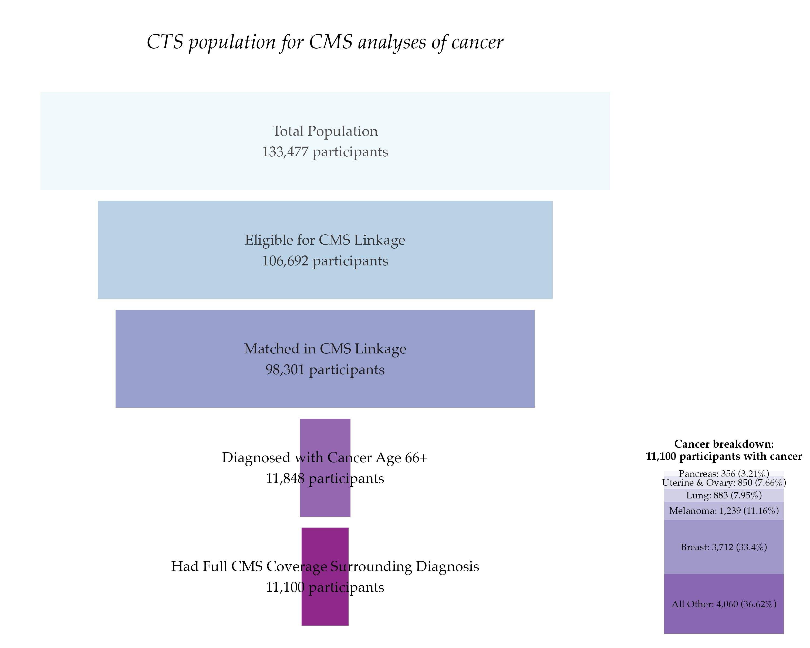

```{r setup, echo=FALSE}
knitr::opts_chunk$set(echo = TRUE)
```



### Packages used

```{r packages, eval=FALSE}
library(tidyverse)
library(scales)
library(patchwork)
```

### Description of inputs

#### Data

1.  A dataframe called "funnel" that includes the text descriptions of each level of the funnel, the count of records, and a position column to center the funnel.

-   Variables
    -   Criteria: text description of each bar of the funnel
    -   N: count of records represented by the criteria
    -   Position: the position column should contain 2 rows for each criteria: one that will be the left-most point of that funnel bar, and one that will be the right-most point. Dividing N by two and using the negative and positive result will center the funnel.
-   As an example, the first 4 rows of the dataframe looks like this:

| Criteria                 | N      | Position |
|--------------------------|--------|----------|
| Total Population         | 133477 | -66738   |
| Total Population         |        | 66738    |
| Eligible for CMS Linkage | 106692 | -53346   |
| Eligible for CMS Linkage |        | 53346    |

2.  A dataframe called "cancers" that contains one row for each cancer type.

-   Variables
    -   Cancer Type: the cancer type label
    -   Criteria: the criteria for the funnel—in this example, the Criteria was "Had Full CMS Coverage Surrounding Diagnosis" for all rows
    -   N: the count of participants with the specified cancer
    -   Percent: the percent of participants with the specified cancer

### Visualization code

```{r viz, eval=FALSE}

# Set colors for text
text.colors <- c("black", "black", "grey10","grey20","grey30")

# Create funnel plot
funnel_plot <- funnel %>%
  ggplot(aes(x = fct_reorder(Criteria,N), y = N, fill = fct_reorder(Criteria,N),
                color = fct_reorder(Criteria,N))) +
  geom_col(aes(y =  Position, color = NULL), width = .9, show.legend =  FALSE, alpha = .9) + 
  coord_flip(xlim = NULL, ylim=c(-68000,68000), expand = TRUE) +
  scale_color_manual(values = text.colors) +
  scale_fill_brewer(palette = 3, direction = -1) +
  geom_text(aes(label = paste0(Criteria, "\n",scales::comma(N), " participants")),
            position = position_stack(vjust = 0), 
            size = 4.5,
            show.legend =  FALSE,
            family = "Palatino")  +
  labs(title = "\nCTS population for CMS analyses of cancer\n") +
  theme_void() +
  theme(plot.title = element_text(face = "italic", size = 18, hjust = 0.5, family = "Palatino"))

# Create cancer stacked bar chart
cancers_plot <- cancers %>% 
  ggplot(aes(x = Criteria, y = N, fill = fct_reorder(`Cancer Type`, N))) +
  geom_col(aes(y =  N), show.legend = FALSE, alpha = .7) + 
  geom_text(aes(label = paste0(`Cancer Type`, ": ",scales::comma(N), " (", Percent, "%)")),
            position = position_stack(vjust = 0.5), size = 3, family = "Palatino") +
  scale_fill_brewer(palette = 12) +
  labs(title = "Cancer breakdown:\n11,100 participants with cancer") +
  theme_void() +
  theme(plot.title = element_text(face = "bold", size = 10, hjust = 0.5, family = "Palatino"))

# Create layout for putting both charts together
layout <- "
AAAA##
AAAA##
AAAAB#
"

# Combine charts
combined_plot <- funnel_plot + cancers_plot +
  plot_layout(design=layout)
```

##### Files in this folder:

-   .png file: image of the viz of the month
-   .Rmd file: the code used to create this document
-   .html file: a downloadable version of this document
