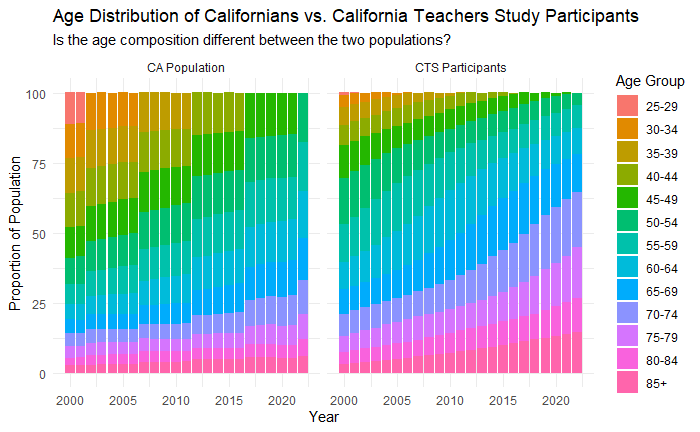

# December 2024 CTS Viz of the Month
Kristen Savage
2024-12-12



### Packages used


``` r
library(ggplot2)
```

### Description of inputs

-   Data
    -   A dataframe called "cts_ca" that captures the proportion of the California population and the proportion of the study population of interest that belonged to each age group during each calendar year
-   Variables
    -   year: stores the calendar years of interest
    -   age_group: the age groups of interest, stored as a character variable
    -   place: the two places/populations, stored as a character variable; for this dataset, the two values are "cts" and "ca"
    -   rate: the proportion of the population that belonged to that age group for that population (place) in a particular year

Note: For this viz, the data must be in a long format, meaning there is a separate row for every age group in every population for every year.

### Visualization code


``` r
cts_ca %>% 
  mutate(place = case_when(place == "ca" ~ "CA Population",
                           place == "cts"~ "CTS Participants")) %>% 
ggplot(aes(fill=age_group, y=rate, x=year)) + 
    geom_bar(position="stack", stat="identity")+
  facet_wrap(~place) +
  theme_minimal() +
  labs(title = "Age Distribution of Californians vs. the California Teachers Study Population", 
       subtitle = "Is the age composition different between the two populations?",
       x = "Year", 
       y = "Proportion of Population", 
       fill = "Age Group")
```

##### Files in this folder:

-   .png file: image of the viz of the month
-   .Rmd file: the code used to create this document
-   .html file: a downloadable version of this document
