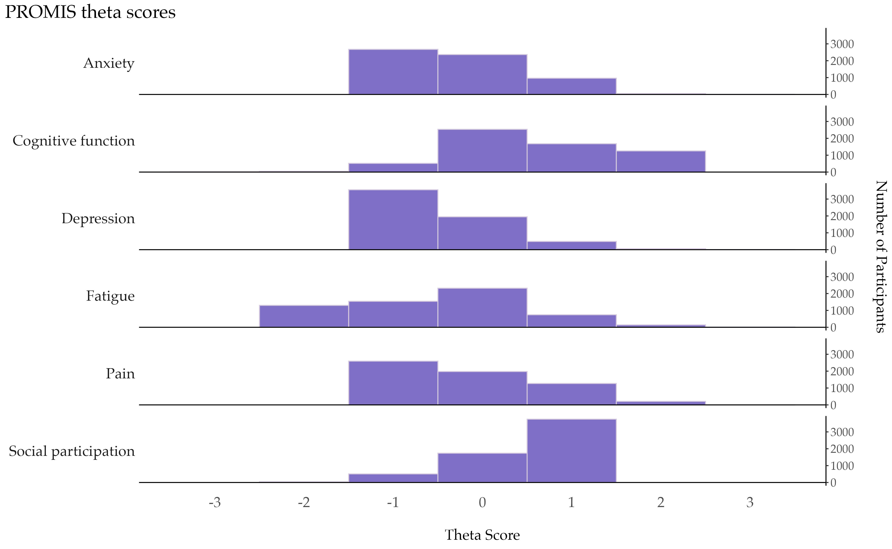

# January 2025 CTS Viz of the Month
Emma Spielfogel
2025-01-01



### Packages used

``` r
# list packages here
library(tidyverse)
```

### Description of inputs

* Data
    + A long dataset called "promis_theta" containing theta scores from the PROMIS survey in a summarized format, at the measure and value level, i.e. where each row contains the count for a particular value for a particular PROMIS measure.

* Variables
    + measure: the name of the PROMIS measure, i.e. "Cognitive function"
    + value: the value of the PROMIS theta score measure, which is restricted to whole number values between -4 and 4
    + n: the count of participants with this particular value for the measure

### Visualization code

``` r
promis_theta %>%
  mutate(measure = fct_reorder(measure, value)) %>%
  ggplot(aes(x=value, y= n)) +
  geom_histogram(alpha=0.8, stat="identity", width=1, fill="#5F4BB6", color = "#D5C9DF") +
  facet_grid(measure ~ ., switch = "y") +
  geom_hline(yintercept=0) +
  theme_classic() +
  scale_y_continuous(position = "right") +
  scale_x_continuous(breaks = -3:3) +
  theme(
    text = element_text(family = "Palatino", size = 16),
    plot.title = element_text(size = 20),
    plot.title.position = "plot",
    legend.position="none",
    panel.spacing = unit(0.6, "lines"),
    panel.grid = element_blank(),
    strip.background    = element_blank(),
    axis.text.x         = element_text(size = 16),
    axis.line.x         = element_blank(),
    axis.ticks.length.x = unit(10, "points"),
    strip.text.y.left   = element_text(angle = 0, size = 16, hjust=1),
    axis.ticks.x        = element_blank()
  ) +
  labs(title = "PROMIS theta scores",
       x="\nTheta Score",
       y = "Number of Participants\n")
```

##### Files in this folder:

- .png file: image of the viz of the month
- .Rmd file: the code used to create this document
- .html file: a downloadable version of this document
