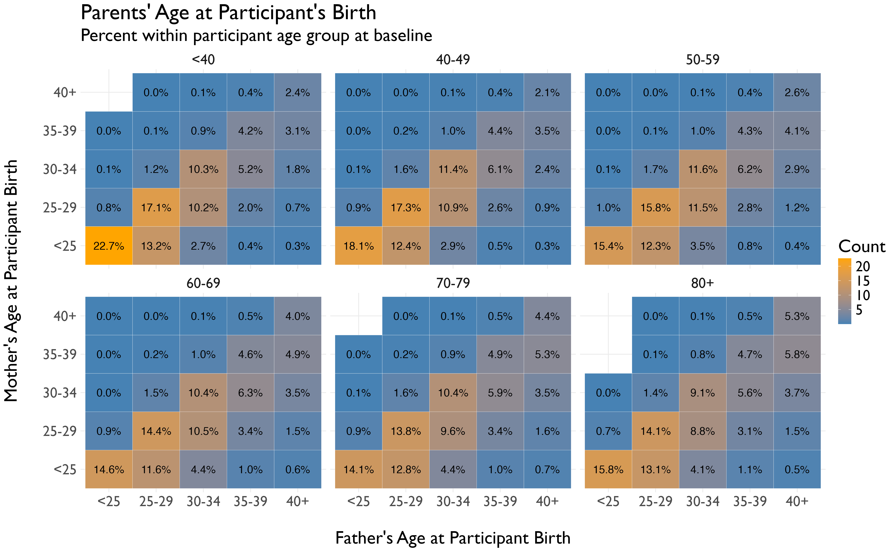

# October 2025 CTS Viz of the Month
Emma Spielfogel
2025-10-01



### Packages used

``` r
library(tidyverse)
```

### Description of inputs

* Data
    + A dataframe called "ages" that contains percents and categorical data of the age of participants at baseline, the age of their mother at the time of the participant's birth, and the age of their father at the time of the participant's birth.

* Variables
    + participant_age: This column contains the participant's age group at the time of the baseline survey, from <40 to 80+, in 10-year increments.
    + mom_age_atbirth: This column contains the participant's mother's age at the time of the participant's birth.
    + dad_age_atbirth: This column contains the participant's mother's age at the time of the participant's birth.
    + percent: This represents the percent within each participant age group at baseline that is composed of each mother's age x father's age pairing.

### Visualization code

``` r
# Visualization for plot
p <- ggplot(ages, aes(x=dad_age_atbirth, y = mom_age_atbirth, fill=percent)) +
  geom_tile(color="white") +
  geom_text(aes(label=sprintf("%.1f%%", percent)), size = 5) +
  scale_fill_gradient(low="steelblue", high="orange") +
  facet_wrap(~participant_age)+
  labs(title="Parents' Age at Participant's Birth",
       subtitle = "Percent within participant age group at baseline",
       x = "\nFather's Age at Participant Birth",
       y = "Mother's Age at Participant Birth\n",
       fill="Count") +
  theme_minimal() +
  theme(text = element_text(family = "Gill Sans",
                            size=24))

# Saving the visualization
ggsave("parents-age-at-participant-birth.png", p, bg = "white")
```

##### Files in this folder:

- .png file: image of the viz of the month
- .Rmd file: the code used to create this document
- .html file: a downloadable version of this document
