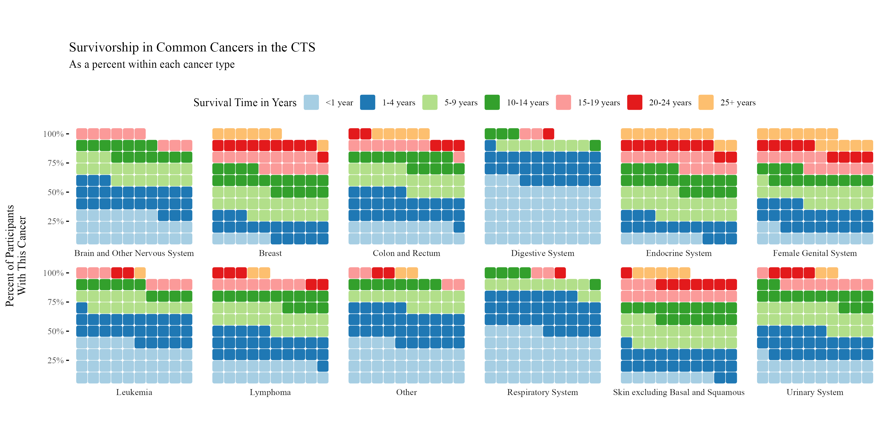

# November 2025 CTS Viz of the Month
Emma Spielfogel
2025-11-01



### Packages used

``` r
library(tidyverse)
library(waffle)
library(hrbrthemes)
```

### Description of inputs

* Data
    + A dataframe called "cancer_survival" that contains the name of the cancer site, survivorship in years (collapsed into categorical groups), and the percent of participants within each cancer type group.

* Variables
    + cancer_site_group: This column contains the name of the cancer site, based on the table at https://seer.cancer.gov/siterecode/icdo3_dwhoheme/.
    + survivorship_in_years: This column contains the participant's survivorship years as a categorical group.
    + percent: This column contains the percent of participants within each cancer group.
    + order_survival: Because survivorship_in_years is categorical, R naturally orders the data alphabetically rather than numerically. This column serves as a numeric column for properly ordering survivorship years.

### Visualization code

``` r
# Visualization for plot
cancer_survival %>% 
  ggplot(aes(fill = fct_reorder(survivorship_in_years,order_survival), values = percent)) +
  geom_waffle(color = "white",
              size = .2,
              n_rows = 10,
              flip = FALSE,
              na.rm=FALSE, 
              radius = unit(2, "pt")) +
  facet_wrap(~cancer_site_group,
             nrow = 2,
             strip.position = "bottom") +
  scale_x_discrete() +
  scale_y_continuous(labels = function(x) paste0(x*10, "%"), # make this multiplyer the same as n_rows
                     expand = c(0,0)) +
  scale_fill_brewer(palette="Paired")+
  coord_equal() +
  labs(
    title = "Survivorship in Common Cancers in the CTS",
    subtitle = "As a percent within each cancer type\n",
    y = "Percent of Participants\nWith This Cancer\n",
    fill = "Survival Time in Years"
  ) +
  theme_minimal(base_family = "Times New Roman") +
  theme(legend.position = "top",
        panel.grid = element_blank(),
        axis.ticks.y = element_line()) +
  guides(fill = guide_legend(reverse = FALSE,
                             nrow=1))

# Saving the visualization
ggsave("cancer-survival.png", 
       width=12, height=6, units="in",bg="white")
```

##### Files in this folder:

- .png file: image of the viz of the month
- .Rmd file: the code used to create this document
- .html file: a downloadable version of this document
