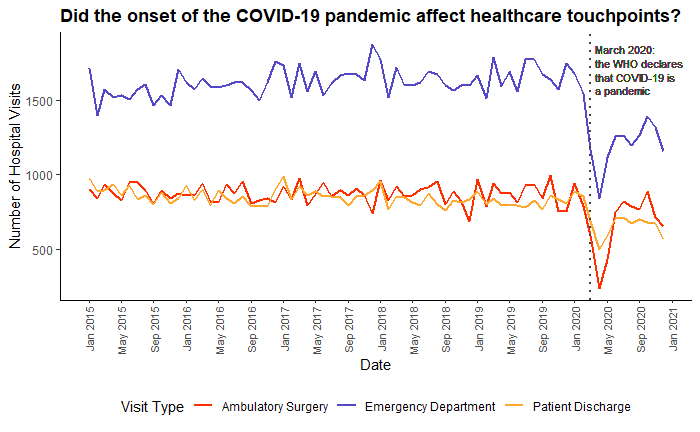

# February 2025 CTS Viz of the Month
Kristen Savage
2025-02-02



### Packages used

``` r
library(tidyverse)
library(lubridate)
library(ggtext)
library(ggplot2)
library(scales)
```

### Description of inputs

* Data
    + A dataframe called 'visit_counts' that contains the count of hospital visits by visit type and vist date

* Variables
    + hospitalization_source: The type of hospital visit, stored as a character value
    + event_mdy: When the hospital visit occurred; this is the month and year stored as a date value (i.e., January 2020 is stored as 2020-01-01)
    + count: The number of hospital visits that occurred for that specific hospitalization visit type in a given month

### Visualization code

``` r
visit_counts%>% 
  ggplot(aes(x = event_ymd, y = count, group = hospitalization_source, color = hospitalization_source)) +
  geom_line(lwd=0.75)+
  scale_color_manual(values = c("#FF2E00", "#5448C8", "#FEA82F"))+
  scale_x_date(date_breaks = "4 months",
               date_labels = "%b %Y",
               limits = c(as.Date("2015-01-01"), as.Date("2020-12-01")))+
  theme_classic()+
  theme(axis.text.x = element_text(angle = 90, vjust = 0.5, hjust = 1, size = 8),
        legend.position = "bottom",
        plot.title= element_text(face = "bold"))+
  labs(title ="Did the onset of the COVID-19 pandemic affect healthcare touchpoints?",
       x = "Date",
       y = "Number of Hospital Visits",
       color = "Visit Type") +
  geom_vline(xintercept = as.numeric(as.Date("2020-03-01")), color = "#423E3B", lwd = 1, lty = "dotted") +
  geom_richtext(x = as.Date("2020-03-01"), y = 1700, size = 2.5, hjust = 0, color = "#423E3B", fontface = "plain",
                fill = NA, label.color = NA, 
           label = "March 2020: <br> the WHO declares <br> that COVID-19 is <br> a pandemic", show.legend = FALSE)
```

##### Files in this folder:

- .png file: image of the viz of the month
- .Rmd file: the code used to create this document
- .html file: a downloadable version of this document
