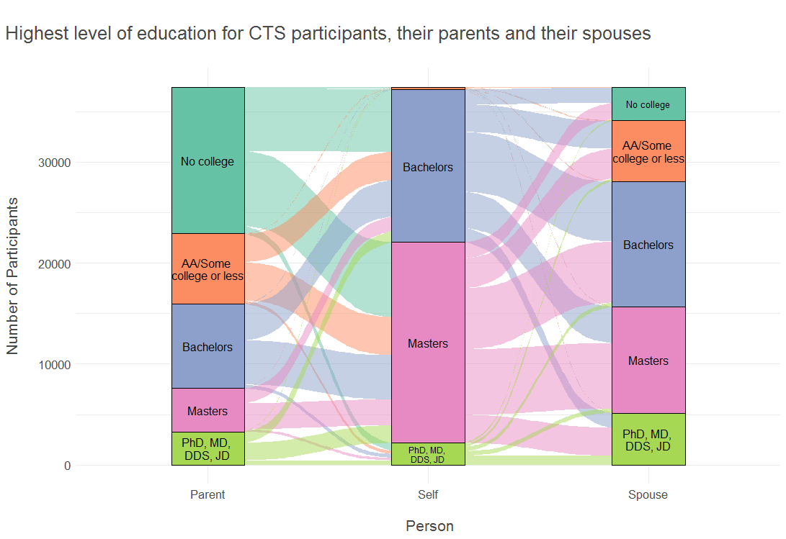

```{r setup, echo=FALSE}
knitr::opts_chunk$set(echo = TRUE)
```



### Packages used
```{r packages, eval=FALSE}
library(tidyverse)
library(ggalluvial)
library(ggfittext)
```

### Description of inputs

* Data
    + A dataframe called "edu" containing 1 row per participant of their parents',
    spouse's and their own education level. Only participants who provided answers to all 3 questions are included.

* Variables
    + eduself: a categorical variable representing the participant's highest level of education
    + eduparent: a categorical variable representing the participant's parents' highest level of education. Whichever parent had the higher level of education is represented here.
    + eduspouse: a categorical variable representing the participant's spouse's highest level of education.

### Visualization code
```{r viz, eval=FALSE}

# Summarize the counts
educounts<- edu %>%
  count(eduself,eduspouse,eduparent)

# Transform the data into long, "lodes" form, which works best for alluvial plots
edu_lodes <- to_lodes_form(as.data.frame(educounts),
                           axes = 1:3,
                           key = "Person",
                           value = "Education",
                           id="Cohort")

# Confirming the data are in lodes form
is_lodes_form(edu_lodes, key = Person, value = "Education", id = Cohort, 
              silent = TRUE)

# Create the alluvial chart
ggplot(edu_lodes,
       aes(x = Person, stratum = Education, alluvium = Cohort,
           y = n,fill = Education, label = Education)) +
  geom_flow() +
  geom_stratum() +
  geom_fit_text(stat="stratum",
             aes(label = after_stat(stratum))) +
  scale_fill_brewer(type = "qual", palette = "Set2") +
  scale_x_discrete(labels = c("Parent","Self","Spouse")) +
  labs(y="Number of Participants\n",
       x="\n Person",
       title = "\nHighest level of education for CTS participants, their parents
       and their spouses\n") +
  theme_minimal() +
  theme(legend.position = "none",
        plot.title.position = "plot",
        text=element_text(size = 16, color = "#48494B"))
```

##### Files in this folder:

- .png file: image of the viz of the month
- .Rmd file: the code used to create this document
- .html file: a downloadable version of this document