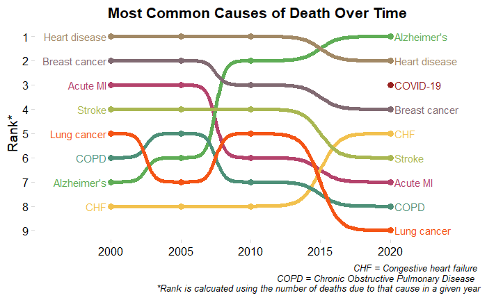

# April 2025 CTS Viz of the Month
Kristen Savage
2025-04-17



### Packages used

``` r
# list packages here
library(tidyverse)
library(ggplot2)
library(cowplot)
library(ggbump)
```

### Description of inputs

* Data
    + A dataframe called "common_causes" that stores years of interest, causes of death, and count by cause of death for each year. This dataframe should be stored in long format (i.e. years will repeat for each cause of death to track changes in count over time).

* Variables
    + death_dt: Years of interest, stored as a dbl value 
    + cause_of_death_dsc: Cause of death descriptions, stored as a character value
    + count: The number of deaths that occurred for that cause of death in that particular year

### Visualization code

``` r
common_causes %>% 
  # filter to select years of choice to show overall trends instead of year-by-year changes
  filter(death_dt == "2000" | death_dt == "2005" |death_dt == "2010" | death_dt == "2020" ) %>% 
  group_by(death_dt) %>% 
  # rank by count; in case of a tie, randomize
  mutate(rank = rank(-count, ties.method = "random")) %>% 
  ungroup() %>% 
  # visualize data
  ggplot(aes(x = death_dt, y = rank, color = cause_of_death_dsc)) +
  geom_point(size = 3) +
  geom_text(data = . %>%  filter(death_dt == min(death_dt)),
            aes(x = death_dt - .3, label = cause_of_death_dsc), size = 4, hjust = 1) +
  geom_text(data = . %>% filter(death_dt == max(death_dt)),
            aes(x = death_dt + .3, label = cause_of_death_dsc), size = 4, hjust = 0)+
  geom_bump(size = 2, smooth = 8) +
  scale_x_continuous(limits = c(1996, 2025),
                     breaks = seq(2000,2021, 5))+
  theme_minimal_grid(font_size = 14, line_size = 0) +
  theme(legend.position = "none",
        panel.grid.major = element_blank(),
        plot.title = element_text(hjust = 0.5),
        plot.caption = element_text(size = 10, face = "italic", hjust = 1))+
  labs(y = "Rank*",
       x = NULL,
       title = "Most Common Causes of Death Over Time",
       caption = "CHF = Congestive heart failure \
       COPD = Chronic Obstructive Pulmonary Disease \ 
       *Rank is calcuated using the number of deaths due to that cause in a given year") +
  scale_y_reverse(breaks = seq(1, 9, by = 1)) +
  scale_color_manual(values=c("#B4436C", "#5FAD56", "#816A72", "#F2C14E", 
                              "#4D9078", "#98211F", "#A28966", "#F45415", "#A9B752"))
```

##### Files in this folder:

- .png file: image of the viz of the month
- .Rmd file: the code used to create this document
- .html file: a downloadable version of this document
