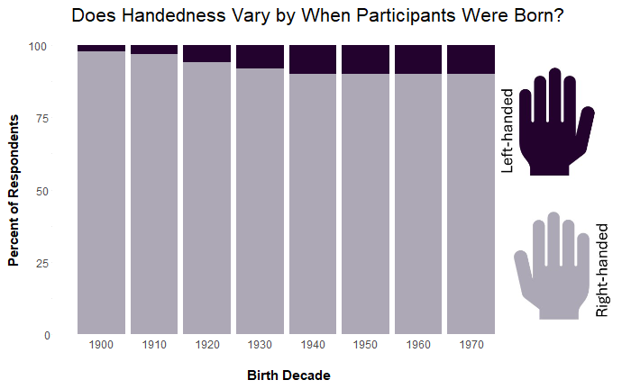

# May 2025 CTS Viz of the Month
Kristen Savage
2025-05-07



### Packages used

``` r
library(tidyverse)
library(ggplot2)
library(pacman)
library(grid)
```

### Description of inputs

* Data
    + A dataframe called "lr_handed" that contains the decade that participants were born and the proportion of participants born in each decade that were left and right handed.
    + An image to be used as the legend, saved as a JPG. For this Viz, the image is two color-coded hands to represent whether the data on the graph represents left-handed participants or right-handed participants. 

* Variables
    + lr_handed: A character variable that captures "left handed" or "right handed"
    + birth_decade: The birth decades, stored as a dbl variable
    + lr_handed_by_decade_pct: The percent of participants born in each specific decade that reported they were left or right handed

### Visualization code

``` r
# read in your image
image <- jpeg::readJPEG("your-file-name.jpg")

lr_handed %>% 
   ggplot(aes(x=birth_decade, y=lr_handed_by_decade_pct, fill = lr_handed)) + 
  # add in the image and specify that the image will take up the whole width of the plot
  annotation_custom(rasterGrob(image,
                               width = unit(1,"npc"),
                               height = unit(1,"npc")),
                            -Inf, Inf, -Inf, Inf) +
  geom_bar(stat = "identity")+
  # expand plot limits so that image sits to the right of the bar chart
  expand_limits(x = 1994) +
  # set x axis markers for the decades included in the data set
  scale_x_continuous(breaks = seq(1900, 1970, by = 10))+
  theme_minimal()+
  theme(legend.position='none',
        plot.title = element_text(size = 16, hjust = 0.25),
        axis.title.y = element_text(face = "bold"),
        axis.text.y = element_text(hjust = 1.3),
        axis.title.x = element_text(face = "bold", hjust = 0.40),
        axis.text.x = element_text(vjust = 10))+
  labs(title = "Does Handedness Vary by When Participants Were Born?",
       color = "",
       x = "Birth Decade",
       y = "Percent of Respondents")+
  scale_fill_manual(values=c( "#23022E", "#ADA8B6"))
```

##### Files in this folder:

- .png file: image of the viz of the month
- .Rmd file: the code used to create this document
- .html file: a downloadable version of this document
