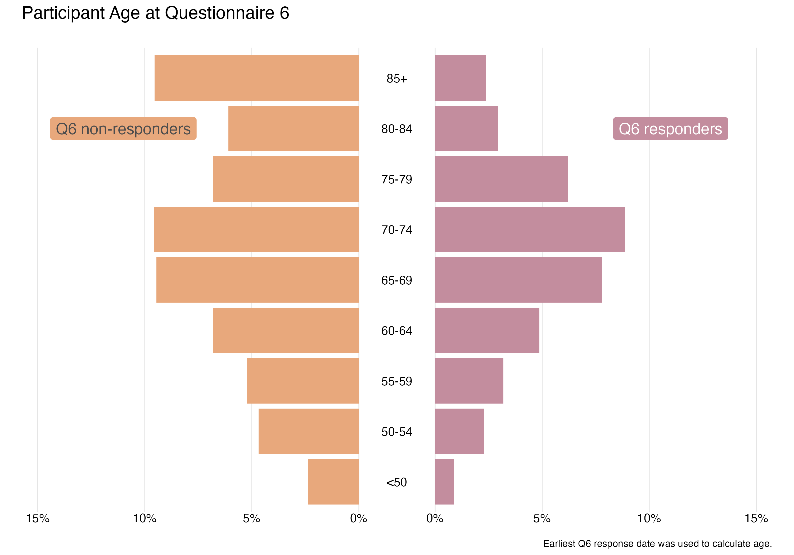

```{r setup, echo=FALSE}
knitr::opts_chunk$set(echo = TRUE)
```



### Packages used

```{r packages, eval=FALSE}
library(tidyverse)
library(patchwork)
library(scales)
```

### Description of inputs

This visualization was designed following the example in [this R For the Rest of Us blog post](https://rfortherestofus.com/2024/07/population-pyramid-part-1) by David Keyes.

-   Data
    -   A dataframe called "q6response" containing response status to the survey (Responder or Non-responder), age category of participants, and number of participants in each response and age grouping. From the count, the percent should be calculated.
-   Variables
    -   q6_responder: response or non-response to the questionnaire
    -   ageq6_c: age category at the time of the questionnaire
    -   n: count of participants in each group
    -   pct: percent of partipants in each group

### Visualization code

```{r viz, eval=FALSE}
# Set the max percent for the chart
max_percent <- 0.15

# Create responders side of chart
population_pyramid_responders <- q6response %>% 
  filter(q6_responder == "Responder") %>% 
  ggplot(aes(
    x = pct,
    y = ageq6_c
  )) +
  geom_col(fill = "#c38d9e") +
  annotate(
    geom = "label",
    x = .11,
    y = 8,
    label = "Q6 responders",
    fill = "#c38d9e",
    color = "white",
    size = 5,
    label.size = 0,
    label.padding = unit(0.3, "lines")
  ) +
  scale_x_continuous(
    labels = function(x) label_percent(accuracy = 1)(abs(x)),
    breaks = breaks_pretty(),
    limits = c(0, max_percent)) +
  theme_void() +
  theme(
    axis.text.x = element_text(),
    panel.grid.major.x = element_line(color = "grey90"),
    plot.margin = margin(0,.5,0,0, "cm"))

# Create non-responders side of the chart
population_pyramid_nonresponders <- q6response %>% 
  filter(q6_responder == "Non-responder") %>% 
  ggplot(aes(
    x = pct,
    y = ageq6_c
  )) +
  geom_col(fill = "#e8a87c") +
  annotate(
    geom = "label",
    x = -.11,
    y = 8,
    label = "Q6 non-responders",
    fill = "#e8a87c",
    color = "grey30",
    size = 5,
    label.size = 0,
    label.padding = unit(0.3, "lines")
  ) +
  scale_x_continuous(
    labels = function(x) label_percent(accuracy = 1)(abs(x)),
    breaks = breaks_pretty(),
    limits = c(-max_percent, 0)
  ) +
  theme_void() +
  theme(
    axis.text.x = element_text(),
    panel.grid.major.x = element_line(color = "grey90"),
    plot.margin = margin(0,0,0,.5, "cm"))
    
# Create middle portion with age categories
age_labels <- tibble(
    age = c("<50","50-54","55-59","60-64","65-69","70-74","75-79","80-84","85+")) %>% 
  mutate(age = fct_inorder(age))

age_labels_plot <- age_labels  %>% 
  ggplot(aes(x = 1,y = age,label = age)) +
  geom_text() +
  theme_void()

# Combine all 3 elements using the patchwork package + add annotation
mychart <- population_pyramid_nonresponders +
  age_labels_plot +
  population_pyramid_responders +
  plot_layout(
    widths = c(8, 1, 8)) +
  plot_annotation(title="Participant Age at Questionnaire 6\n",
                  caption="\nEarliest Q6 response date was used to calculate age.",
                  theme = theme(plot.title = element_text(size = 16)))
```

##### Files in this folder:

-   .png file: image of the viz of the month
-   .Rmd file: the code used to create this document
-   .html file: a downloadable version of this document
