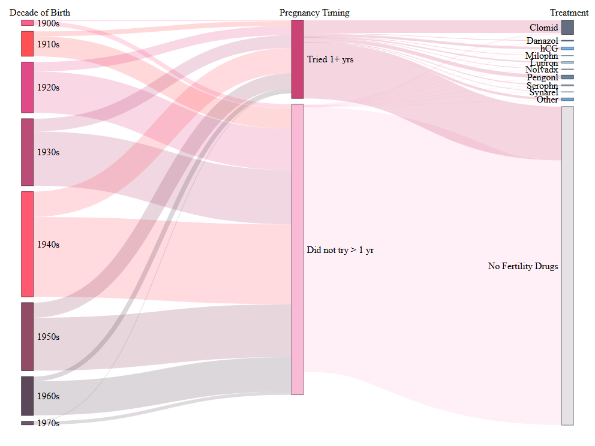

# July 2025 CTS Viz of the Month
Kristen Savage
2025-07-01



### Packages used

``` r
library(tidyverse)
library(networkD3)
library(htmlwidgets)
library(webshot2)
```

### Description of inputs

* Data
    + A dataframe called "data_cts" that stores aggregated data on possible combinations of when participants were born (by decade), whether they ever tried for a year or longer to get pregnant, and any fertility drugs they used.

* Variables
    + source: This character column contains all the possible starting "nodes" in the chart. For this particular chart, source contains both all possible decades of birth as well as all possible pregnancy outcomes ('Tried 1+ yrs' and 'Did not try > 1 yr').
    + target: This character column contains all possible targets or ending "nodes". For this particular chart, target contains all possible pregnancy outcomes ('Tried 1+ yrs' and 'Did not try > 1 yr'), which are the targets for birth year source, as well as all possible fertility treatment outcomes (i.e., Clomid, Danazol, hCG, Milophn, Lupron, Nolvadx, Pengonl, Serophn, Synarel, Other, No Fertility Drugs)
    + count: The number of participants who had each unique source::target combo. For instance, the first row would contain the count of participants who were born in the 1900s and "Tried 1+ years"; the number of participants who were born in the 1900s and "Did not try > 1 yr" would be stored in the second row count. 

### Visualization code

``` r
# Create nodes
nodes_cts <- data.frame(name=c(as.character(data_cts$source), as.character(data_cts$target)) %>% 
                          unique())

# Assign IDs to each source and to each target
data_cts$IDsource=match(data_cts$source, nodes_cts$name)-1 
data_cts$IDtarget=match(data_cts$target, nodes_cts$name)-1 


# Assign colors to the nodes
colors = 'd3.scaleOrdinal().range(["#FF4D80", "#FF3E41", "#DF367C","#B43869","#FF4661", "#883955", "#4C3549", "#5C475A",
                                      "#C62E65", "#F9B3D1",
                                      "#545E75", "#5C86B4", "#63ADF2", "#85BDF0", "#A7CCED", 
                                      "#304D6D","#597795","#82A0BC", "#96C5EF", "#609AD3",
                                      "#E3DEE3"])'


# Make Sankey Network
p <- networkD3::sankeyNetwork(Links = data_cts, Nodes = nodes_cts, Source = "IDsource",
              Target = "IDtarget", Value = "count", NodeID = "name",
              units = "TWh", 
              colourScale=colors,
              fontSize = 16, 
              nodeWidth = 20,
              iterations = 0)

# Create function so each link takes its color from the node that precedes it
javascript_string <- 
  'function(el) {
     d3.select(el).selectAll(".link")
       .style("stroke", d => d.source.color);
  }'


# Update link colors using javascript_string code
p1 <- htmlwidgets::onRender(p, jsCode = javascript_string)


# Add labels to each Sankey stage
p2 <- htmlwidgets::onRender(p1, '
  function(el) { 
    var cols_x = this.sankey.nodes().map(d => d.x).filter((v, i, a) => a.indexOf(v) === i).sort(function(a, b){return a - b});
    var labels = ["Decade of Birth", "Pregnancy Timing", "Treatments"];
    cols_x.forEach((d, i) => {
      d3.select(el).select("svg")
        .append("text")
        .attr("x", d)
        .attr("y", 12)
        .attr("font-size", 16)
        .text(labels[i]);
    })
  }
')


# save viz
saveNetwork(p2,"sn.html")

webshot2::webshot("sn.html", "preg-fert-drugs.png")
```

##### Files in this folder:

- .png file: image of the viz of the month
- .Rmd file: the code used to create this document
- .html file: a downloadable version of this document
