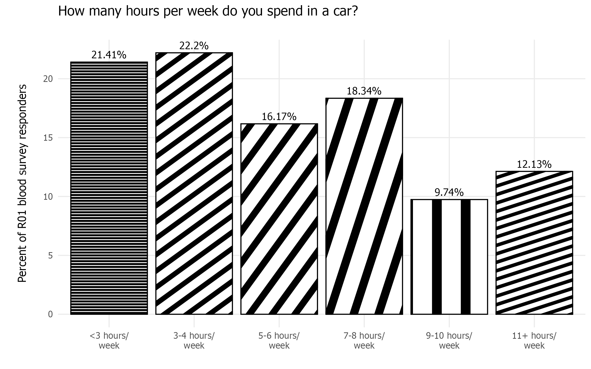

# August 2025 CTS Viz of the Month
Emma Spielfogel
2025-08-01



### Packages used

``` r
library(tidyverse)
library(ggpattern)
```

### Description of inputs

* Data
    + A dataframe called "car_data" that contains data on the hours per week participants spent in a car as a percent.

* Variables
    + hours: This column contains the text description of how many hours per week the participants spent in a car.
    + percent: This is the percent of participants who reported the corresponding hours per week.
    + hours_num: This is a numeric column that corresponds with the hours column from lowest to highest, i.e. 1 corresponds to the lowest value (<3 hours/week) and 6 corresponds to the largest value (11+ hours per week). This column is used to order the plot.

### Visualization code

``` r
# Storing the data frame
car_data <- data.frame(
  hours_num = c(1,2,3,4,5,6),
  hours = c("<3 hours/\nweek", "3-4 hours/\nweek","5-6 hours/\nweek","7-8 hours/\nweek",
            "9-10 hours/\nweek","11+ hours/\nweek"),
  percent = c(21.41,22.20,16.17,18.34,9.74,12.13)
)

# Creating the ggpattern plot
p <- ggplot(car_data, aes(reorder(hours, hours_num), percent)) +
  geom_col_pattern(
    aes(pattern = hours,  pattern_angle = hours, pattern_spacing = hours), 
    pattern = "stripe",
    fill            = 'white',
    colour          = 'black', 
    pattern_density = 0.3, 
    pattern_fill    = 'black',
    pattern_colour  = 'black'
  ) +
  geom_text(aes(label=paste0(percent,"%")),
            vjust=-0.5,
            size=3.5,
            family="Tahoma") +
  labs(
    title    = "How many hours per week do you spend in a car?",
    subtitle = '',
    y = "\nPercent of R01 blood survey responders\n",
    x = ""
  ) +
  scale_pattern_spacing_discrete(range = c(0.01, 0.1)) + 
  theme_minimal() +
  theme(legend.position = 'none',
        panel.grid.minor = element_blank(),
        text = element_text(family = "Tahoma"))

# Saving the visualization
ggsave("hours-spent-in-car.png", p, bg = "white",
       units = "in", width=8, height=5)
```

##### Files in this folder:

- .png file: image of the viz of the month
- .Rmd file: the code used to create this document
- .html file: a downloadable version of this document
