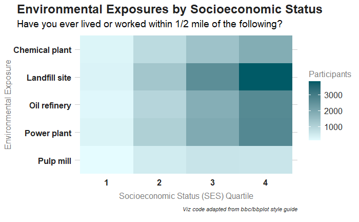

# September 2025 CTS Viz of the Month
Kristen Savage
2025-09-01



### Packages used

``` r
# list packages here
library(tidyverse)
library(dplyr)
library(bbplot)
library(forcats)
```

### Description of inputs

* Data
    + A dataframe called "ses_exposures" that stores participants' socioeconomic status (SES) quartile at baseline, the environmental exposures, and the count of how much participants in each SES quartile were exposed to each environmental exposure

* Variables
    + ses_quartile_ind: Socioeconomic status (SES) indicator assigned to participants at baseline (first study questionnaire). Participants have a score between 1 and 4, stored as a numerical value.
    + location: A character variable that stores the different environmental exposures, i.e. power plant, pulp mill, chemical plant, etc.
    + count: The number of participants who had the specific SES quartile & environmental exposure listed in that row. 

Note: for this viz, the dataframe is stored in a long format, so both ses_quartile_ind and location will repeat multiple times to reflect the full range of possibilities for SES level x exposure type.

### Visualization code

``` r
# set style formats, adapted from https://github.com/bbc/bbplot/blob/master/R/bbc_style.R
bbc_style <- function() {
  font <- "Helvetica"

  ggplot2::theme(

  #Text format:
  #This sets the font, size, type and color of text for the chart's title
  plot.title = ggplot2::element_text(family=font,
                            size=18,
                            face="bold",
                            color="#222222", 
                            hjust = 0.7),
  #This sets the font, size, type and color of text for the chart's subtitle, 
  # as well as setting a margin between the title and the subtitle
  plot.subtitle = ggplot2::element_text(family=font,
                               size=14,
                               hjust =1.35),
  plot.caption = ggplot2::element_text(family=font,
                            size=8,
                            face="italic",
                            color="#222222",
                            margin=ggplot2::margin(t = 9,r = 0,b = 9, l = 0)),

  #Legend format
  #This sets the position and alignment of the legend, removes the background, 
  # for it and sets the requirements for any text within the legend.
  legend.position = "right",
  legend.text.align = 0,
  legend.background = ggplot2::element_blank(),
  legend.title = ggplot2::element_text(family=font,
                             size=12,
                             color="#7A7A7A"),
  legend.key = ggplot2::element_blank(),
  legend.text = ggplot2::element_text(family=font,
                             size=12,
                             color="#222222",
                             margin=ggplot2::margin(t = 0, r = 5, b = 10, l = 5)),

  #Axis format
  #This sets the text font, size and color for the axis test, as well as setting the
  # margins and removes lines and ticks. 
  axis.title = ggplot2::element_text(family=font,
                           size=12,
                           color="#7A7A7A",
                           vjust = -0.5),
  axis.text = ggplot2::element_text(family=font,
                                    face="bold",
                           size=12,
                           color="#222222"),
  axis.text.x = ggplot2::element_text(margin=ggplot2::margin(t = 0, r = 0, b = 5, l = 0)),
  axis.ticks = ggplot2::element_blank(),
  axis.line = ggplot2::element_blank(),

  #Grid lines
  #This removes all minor grid lines and adds major y grid lines. 
  panel.grid.minor = ggplot2::element_blank(),
  panel.grid.major.y = ggplot2::element_line(color="#cbcbcb"),
  panel.grid.major.x = ggplot2::element_blank(),

  #Blank background
  #This sets the panel background as blank, removing the standard grey ggplot background 
  #  color from the plot
  panel.background = ggplot2::element_blank(),

  #Strip background (#This sets the panel background for facet-wrapped plots to white, 
  # removing the standard grey ggplot background color and sets the title size of the
  # facet-wrap title to font size 22)
  strip.background = ggplot2::element_rect(fill="white"),
  strip.text = ggplot2::element_text(size  = 22,  hjust = 0)
  )
}


# make the viz
ses_exposures %>% 
ggplot(aes(x = ses_quartile_ind, y = forcats::fct_rev(location), fill = count)) + 
  geom_tile()+
  scale_fill_gradient(low = "#E5FCFF",
                    high = "#005A66",
                    guide = "colorbar") + 
  labs(title = "Environmental Exposures by Socioeconomic Status",
       subtitle = "Have you ever lived or worked within 1/2 mile of the following?",
       caption = "Viz code adapted from bbc/bbplot style guide",
       x = "Socioeconomic Status (SES) Quartile",
       y = "Environmental Exposure",
       fill = "Participants")+
bbc_style()
```

##### Files in this folder:

- .png file: image of the viz of the month
- .Rmd file: the code used to create this document
- .html file: a downloadable version of this document
